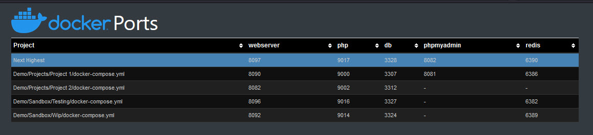
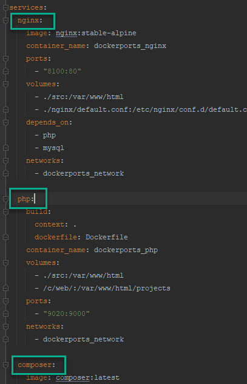

# Docker Service Ports

Needed a list with the Docker service ports to prevent duplicate ports for projects.



---
## Requirements

Docker

----

## Installation

Download the files from this repository.

### Mount volumes

In `docker-compose.yml` add the volume from your disk where you want to scan `docker-compose.json` files.
Example:
```
volumes:
- ./src:/var/www/html
- /c//web:/var/www/html/projects
```
Don't change `- ./src:/var/www/html`, this is for this Docker project.

`/c//web` will point to ```c:/web/``` on my computer.  
This is probably different on your machine so change `/c//web` but leave `:/var/www/html/projects` as it is. 


### src/config.php

We need to add the `docker-compose.json` locations, and add the services for the ports.  
Open this file in your editor

#### projectLocations

Add the project location where your `docker-compose.json` files are.

Lets assume you have 4 locations

*  Projects/Project 1/docker-compose.json
*  Projects/Project 2/docker-compose.json
*  Sandbox/Testing/docker-compose.json
*  Sandbox/Wip/docker-compose.json

Now you can add those project locations
```php
'projectLocations' => [
    'Projects/Project 1',
    'Projects/Project 2',
    'Sandbox/Testing',
    'Sandbox/Wip'
];
```
Or shorter / with wildcards

``` php
'projectLocations' => [
    'Projects/**/**',
    'Sandbox/**/**'
];
```

#### Services

Add the services where you want the get the ports.  

```php
'services' => [
        'webserver' => ['nginx', 'apache'],
        'php' => ['php'],
        'db' => ['mysql', 'db'],
        'phpmyadmin' => ['phpmyadmin'],
        'redis' => ['redis']
    ],
```
The array keys are the service names in the HTML table, the array values are the services key to search for in the `docker-compose.json` files.



### Sart the docker containers for this project

In the root of this project, 
`docker-compose up -d --build`

### Install the composer packages

`docker-compose run composer install`

### Open your webbrowser

Now you can see the ports for your Docker services, `httt://localhost:8100`